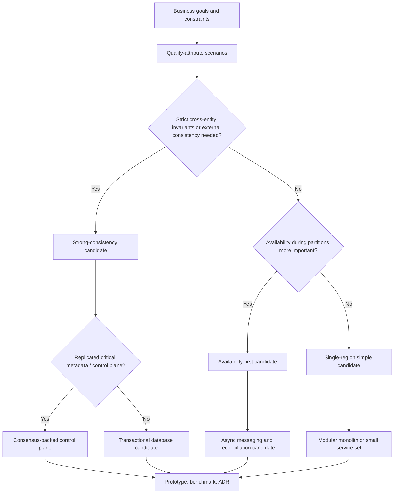

# ATAM-lite option evaluation with ADRs

When several architectures are *all plausible*, the work is comparing them against the qualities that matter and recording why you chose one. Borrowed from the Quality Attribute Workshop (QAW) and the Architecture Tradeoff Analysis Method (ATAM), trimmed to something a team can do in days, not weeks: make quality-attribute scenarios explicit → compare a *few* candidate architectures against them → surface sensitivities and trade-off points → prototype the riskiest assumption → write an ADR with the rejected alternatives included.

Who runs it: senior engineers, system architects, SREs. **Have the actual operators in the room** — a review without them is a review of fiction. It costs more calendar time than `requirements-slo-design`, but far less than discovering a bad platform choice in production.

## Process

1. **Short quality-attribute workshop.** Produce a *ranked* set of concrete scenarios (not "it should be scalable" but "during a single-AZ outage, writes to the order path still succeed within 500 ms p99"). → output: `templates/quality-attribute-scenarios.md`.
2. **Select two or three realistic candidate architectures.** Not ten. Assign stable candidate IDs (`candidate-a`, `candidate-b`, `candidate-c`). → output: a one-paragraph sketch + a LikeC4 container view per candidate.
3. **Trace each ranked scenario through each candidate.** Mark **sensitivity points** (a decision that strongly affects one quality), **trade-off points** (a decision that affects two qualities in opposite directions), and **risks**. → output: rows in the trade-off matrix.
4. **Score each candidate** against latency, throughput, availability, cost, operability, and **reversibility**. Use a coarse scale (e.g. ++ / + / 0 / − / −−); don't fake precision. → output: `templates/tradeoff-matrix.md`.
5. **Build a spike or benchmark for the single most uncertain assumption** — usually a latency, saturation, or cost number. Theory must not outrun measurement. → output: benchmark notes.
6. **Write the ADR**: chosen option, *rejected* options and why, evidence, consequences, exit criteria, review date. → output: `templates/adr-template.md`.

Then invoke bundled **`likec4`** with the chosen candidate to produce the `.c4` document; keep the rejected candidates' container views in appendix views when they aid the record.

## LikeC4 handoff contract

- Model each candidate with the same actors, external systems, and critical flow labels so differences are comparable.
- Create one container view per candidate, named from the stable candidate ID, e.g. `candidate-a-containers`.
- After the ADR chooses an option, make the chosen option the final context/container/dynamic view set. Do not leave only candidate sketches.
- Preserve rejected candidates as appendix views only when they clarify the ADR; otherwise summarize them in ADR text.
- Link or summarize the ADR and riskiest-assumption benchmark in `description`, `notes`, or `metadata`.

## Decision tree for distributed data-path choices

The recurring hard question is whether the data path needs strict cross-entity invariants or can tolerate reconciliation. CAP makes the constraint concrete: a partition-tolerant distributed system cannot be both strongly consistent and fully available during a partition.

Reference points: the availability-first side resembles the Dynamo design (versioning, quorums, reconciliation); the strict-consistency side resembles Spanner (externally consistent transactions, higher write latency/cost); a replicated control plane (config, leader election, cluster metadata) shifts the question toward Raft-style consensus and *blast radius*, not "database vs queue".

## Worked mini-cases

- **Tolerates divergence:** product-catalog caching, shopping-cart session state → availability-first with versioning + queues + reconciliation often wins.
- **Needs invariants:** inventory reservation, payments, ledger posting → externally consistent transactions often win despite higher write latency / cost.
- **Control-plane:** configuration, leader election, cluster metadata → the question is *which* consensus mechanism and *what blast radius if it stalls*, not which database.

## Failure modes to watch

Mostly social/procedural: scoring spreadsheets that imply more precision than the evidence supports; reviews run without the operators; ADRs that record the chosen option but omit the rejected ones or the consequences; skipping the prototype and letting theory outrun measured latency/saturation/cost; comparing ten candidates instead of three (analysis paralysis).

## Required artifacts

- Ranked quality-attribute scenarios (`templates/quality-attribute-scenarios.md`)
- A LikeC4 container view per candidate (a few, not many), with stable candidate IDs
- Trade-off matrix with sensitivity points, trade-off points, risks (`templates/tradeoff-matrix.md`)
- Benchmark / spike notes for the riskiest assumption
- One or more ADRs with rejected alternatives and a review date (`templates/adr-template.md`)
- The final LikeC4 model for the chosen option (via bundled `likec4`), including context, container, and dynamic critical-flow views

## Engineer-facing checklist

- [ ] The top quality scenarios are ranked and concrete (stimulus → environment → response → measure).
- [ ] Only a few realistic candidate architectures are compared.
- [ ] Trade-off points, sensitivity points, risks, and reversibility are visible.
- [ ] The riskiest assumption is benchmarked or prototyped, not just argued.
- [ ] The ADR records the chosen option, the rejected options, the evidence, and a review date.
